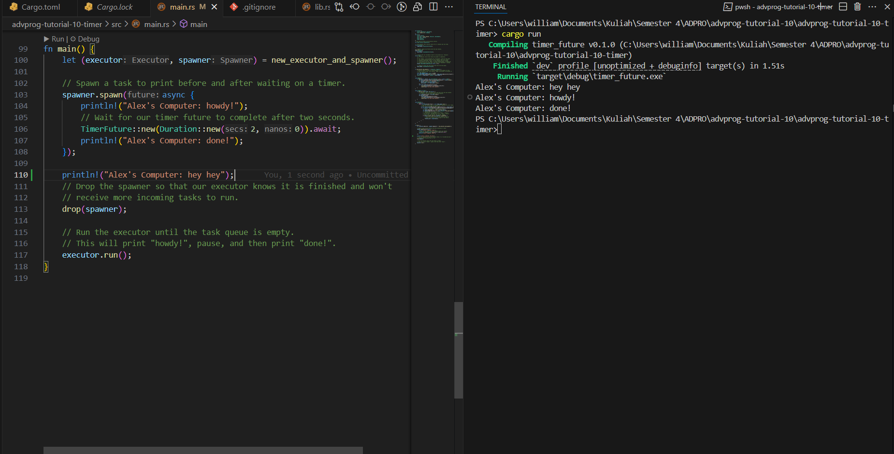
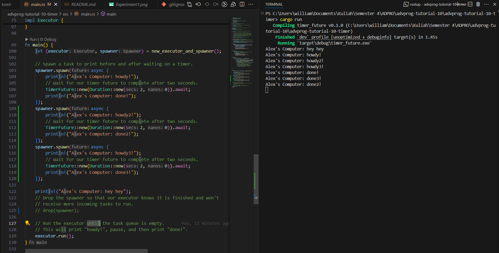

# advprog-tutorial-10

## Experiment 1.2: Understanding how it works

As we can see from the image above, the result shows that "hey hey" is printed before "howdy!" and "done!". This is due to the nature of the asynchronous programming. Since the command to print "howdy!" and "done!" are included inside the spawned task, it would only be run once the executor is instructed to run tasks in the queue. On the other hand, the instruction to print "hey hey" is coded synchronously, hence allowing it to print immediately upon calling `cargo run` in the terminal, thus the result shown in the image where "hey hey" precedes the other messages.

## Experiment 1.3: Multiple Spawn and removing drop

As we can see in the result, there are exactly 6 printed messages, each matching the instructions on the main function. However, we could see that the order does not matter, in this case, as all of them are running on different asynchonous tasks. One thing remains clear, the program does not stop even after all the messages are printed as we have removed the drop spawner call.